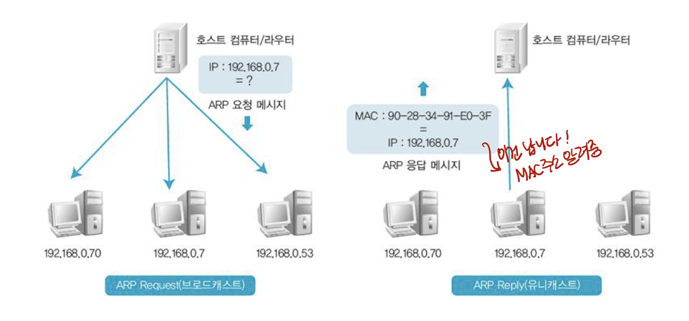
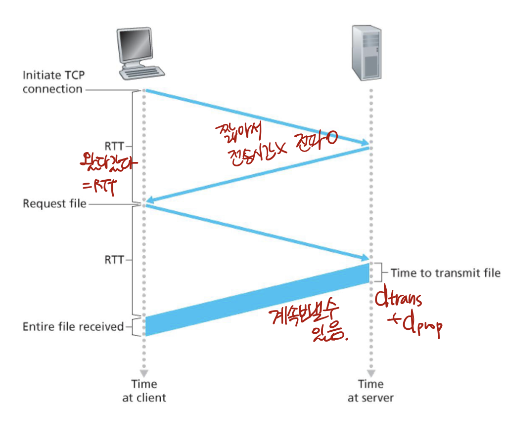
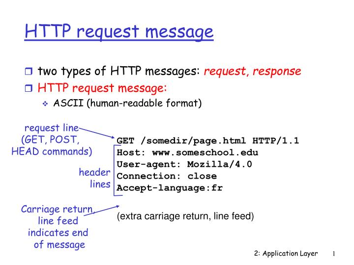
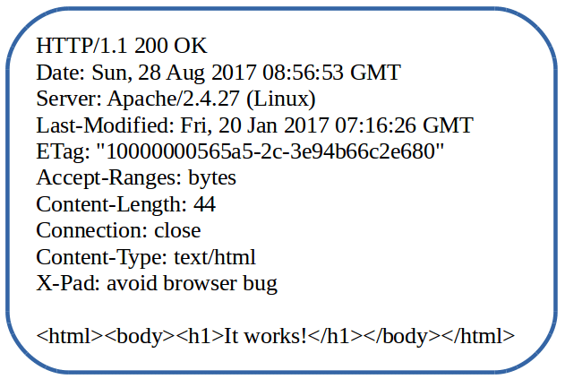

# 네트워크란?

모뎀이나 LAN, 케이블, 무선매체 등 **통신설비**를 갖춘 컴퓨터로 **서로 연결**하는 조직이나 체계, 통신망

## LAN vs WAN

- **LAN**, Local Area Network
  
  근거리 통신망, 한 건물이나 학교 내 캠퍼스처럼 비교적 가까운 지역에 한정된 통신망
  
  이더넷(유선LAN), 와이파이(무선LAN)

- **WAN**, Wide Area Notwork
  
  LAN이 넓은 지역에 걸쳐 연결되어 있는 것, 범위가 넓은 네트워크
  
  인터넷

## 네트워크의 통신 방식

- **서버 - 클라이언트** 시스템
  
  데이터를 제공하는 쪽이 서버, 데이터를 요청하고 받는 쪽이 클라이언트
  
  1. **Unicast**
     
     네트워크에서 가장 많이 사용 **1:1** 통신
     
     **MAC 주소를 이용**해 통신, 데이터의 수신지 MAC 주소가 나의 MAC 주소와 동일하면 수신한다.
  
  2. **Broadcast**
     
     로컬 LAN에 있는 **모든 네트워크 단말기**에 데이터를 보내는 방식이다.
     
     모두에게 전송하기 때문에 네트워크 성능이 저하될 수 있음
     
     받은 데이터는 모두 CPU에서 처리하므로 컴퓨터 성능도 저하
     
     브로드캐스트의 **주소**
     
     - **MAC** : FF-FF-FF-FF-FF-FF
     - **IP** : 네트워크가 속하는 모든 IP 주소 중 맨 마지막 주소
  
  3. **Multicast**
     
     특정 그룹에게만 전송할 수 있음, 필요한 곳에만 전송
     
     → 유니캐스트를 반복할 필요가 없음, 브로드캐스트처럼 무분별하게 보내지 않을 수 있음

## 프로토콜

컴퓨터와 컴퓨터 사이에 메시지를 전달하는 과정에서 생긴 규약

메시지를 주고받을 때의 포맷과 순서를 미리 정해놓았음

## ⭐네트워크 계층 구조⭐

**OSI-7 layer 네트워크 모델**

| 7계층 | Application Layer  | 응용 계층     |
| --- | ------------------ | --------- |
| 6계층 | Presentation Layer | 표현 계층     |
| 5계층 | Session Layer      | 세션 계층     |
| 4계층 | Transport Layer    | 전송 계층     |
| 3계층 | Network Layer      | 네트워크 계층   |
| 2계층 | Data Link Layer    | 데이터 링크 계층 |
| 1계층 | Physical Layer     | 물리 계층     |

### 1계층: 물리 계층

- 상위 계층에서 전송된 데이터를 물리매체를 통해 다른 시스템에 **전기적 신호(0과 1)**로 전송

- 전송 측
  
  데이터 링크 계층(2계층)에서 0과 1로 구성된 비트열의 데이터(**프레임**)를 받아 전기적 신호로 변환 후 전송매체를 통하여 수신 측에 전송

- 수신 측
  
  전기 신호를 0과 1로 구성된 비트열로 복원하여 데이터 링크 계층(2계층)에 전송

- **장치** - 허브, 리피터

### 2계층: 데이터 링크 계층

- 신뢰성 있는 전송을 보장하기 위한 계층, 에러를 체크하며 오류 제어와 흐름 제어

- 데이터 단위 - **프레임**

- 전송 측
  
  3계층에서 내려온 데이터(프레임)에 **트레일러**와 **헤더**를 붙인다.
  
  **헤더**에는 물리적 주소(송신지의 MAC주소, 수신지의 MAC 주소)가 들어있음
  
  **트레일러**에는 오류를 검출하는 특별한 비트들이 있음

- 수신 측
  
  프레임을 받으면 헤더와 트레일러 제거, 3계층(네트워크 계층)으로 전송

- **프로토콜** - **이더넷**

- 장비 - 브리지, L2 스위치, 스위치의 MAC주소 테이블

### 3계층: 네트워크 계층

- LAN을 벗어난 통신을 하기 위해 **IP 주소**를 사용함

- 라우팅 프로토콜을 사용하여 여러 노드를 거칠 때마다 최적의 경로를 찾아주는 역할

- 데이터 단위 - **패킷**

- 전송 측
  
  4계층에서 내려온 데이터(세그먼트)에 ip헤더(송신지의 논리적 주소, 수신지의 논리적 주소)를 붙인다.

- 프로토콜
  
  - **ARP(Address Resolution Protocol)**
    
    IP주소를 통해 LAN까지는 접근하지만, 수신자의 MAC 주소를 모를 때 MAC 주소를 알아내기 위해 사용하는 프로토콜.
    
    

- **IP(Internet Protocol)**
  
  두 노드 간의 데이터 전송 경로를 확립해주는 역할
  
  32자리 2진수, 8자리마다 점을 찍어 구분
  
  **A, B, C**, D, E 클래스로 나눈다.
  
  - 사설 네트워크 : 대부분 C클래스, 공인 네트워크 주소 부족 현상을 해결하기 위해 많이 사용

- ICMP(Internet Control Message Protocol), IGMP(Internet Group Management Protocol)

- 장비 - **라우터**
  
  논리적으로 분리된 둘 이상의 네트워크를 연결함, 패킷의 최적 경로를 찾기 위한 라우팅 테이블 구성
  
  - 정적 라우팅, 동적 라우팅

### 4계층: 전송 계층

- TCP/UDP와 관련된 계층, 오류 복구와 흐름 제어를 담당하여 신뢰성 있는 데이터를 주고받을 수 있게 함

- 또한, 네트워크 계층에서 온 데이터를(패킷) 세션 계층의 어느 애플리케이션에게 보낼 것인지 판독, 전송할 포트를 선택함(ex. http면 80번 포트)

- 데이터 단위 - **세그먼트**

- 송신 측
  
  세션 계층의 데이터를 나누고, 각 데이터의 머리에 tcp헤더를 달아준다(패킷의 순서)

- 수신 측
  
  네트워크 계층에서 받은 패킷의 tcp헤더를 보고 세그먼트를 재조합한다, 세션 계층으로 보낸다.

- 프로토콜
  
  - **TCP(Transmission Control Protocol)**
    
    TCP가 가진 주소는 포트, 0~65535번까지 존재하므 1023번까지는 다른 서비스가 씀
    
    수신지까지 데이터가 가려면 IP주소, MAC주소, 그리고 포트 번호도 필요함(데이터의 이동경로)
    
    → 우리가 동시에 여러 파일을 다운할 수 있는 이유는 포트를 여러 개 사용하기 때문이다.
    
    TCP는 통신 전 연결 설정 과정, 그리고 연결 해제 과정을 거치기 때문에 **신뢰되는 통신**을 한다.
  
  - **UDP(User Datagram Protocol)**
    
    TCP와 달리 연결 설정 과정, 연결 해제 과정 없음
    
    → 데이터의 무결성을 보장받지 못함
    
    → 네트워크의 부하를 주지 않음
    
    패킷이 좀 손실돼도 괜찮을 때, 속도가 더 중요할 때 UDP를 사용함

### 5계층: 세션 계층

- 양 끝단의 응용 프로세스가 통신을 관리하기 위한 방법을 제공
- 통신장치 간의 설정을 유지하고 동기화하는 역할

### 6계층: 표현 계층

- 데이터의 형식(jpeg, fig, mpeg, 등..)을 정의
- 코드 간의 번역을 담당

### 7계층: 응용 계층

- 사용자나 응용 프로그램 사이에 데이터 교환을 가능하게 하는 계층
- 데이터 단위 - **메시지**
- 프로토콜 - FTP, Telnet, POP3&IMAP, SMTP, DNS, TFTP, HTTP

| 7계층 | Application Layer  | 응용 계층     | 메시지  |         | DNS, HTTP |
| --- | ------------------ | --------- | ---- | ------- | --------- |
| 6계층 | Presentation Layer | 표현 계층     |      |         |           |
| 5계층 | Session Layer      | 세션 계층     |      |         |           |
| 4계층 | Transport Layer    | 전송 계층     | 세그먼트 | TCP헤더   | TCP/UDP   |
| 3계층 | Network Layer      | 네트워크 계층   | 패킷   | IP헤더    | IP, ARP   |
| 2계층 | Data Link Layer    | 데이터 링크 계층 | 프레임  | 헤더+트레일러 | Ethernet  |
| 1계층 | Physical Layer     | 물리 계층     |      |         |           |

컴퓨터는 **연결**되어 있다!!

- host들(네트워크 app을 작동시키는 말단의 장비들)

**어떻게 연결**돼있니??

- 유선 - **광섬유**, 동축 케이블
- 무선 - 라디오신호, 위성
- 전송 속도는 bandwidth!

연결된 길을 **어떻게 찾아가니?**

- **라우터**는 LAN들을 연결해줌!! WAN이 되겠죠?
- LAN 내부에서는 **패킷 스위치 방식**을 이용해!

# 7계층 - 응용 계층(Application Layer)

p2p 통신은 소수, 대다수가 **서버-클라이언트 통신**

- **서버**
  
  always-on host
  
  IP주소는 변하지 않음(고정 IP)

- **클라이언트**
  
  항상 연결돼있지 않아도 됨
  
  동적 IP를 할당받음
  
  클라이언트끼리 통신하지 않음

### 프로세스

프로세스는 **호스트에서 실행 중인 프로그램**

같은 호스트의 프로세스들은 컴퓨터 내에서 통신할 수 있지만, 다른 호스트의 프로세스들은 어떻게 통신할까?

메시지를 주고받는다!

→ 통신을 **시작**하는 프로세스 = **클라이언트**

→ 통신을 **기다리는** 프로세스 = **서버**

### 소켓(≠포트)

메시지는 소켓을 통해 왔다갔다 합니다!

그래서 통신하고 싶으면 프로세스가 소켓을 만들어서 할당함

소켓이랑 포트랑 뭐가 다르냐?

서버를 생각해보면, 보통 한가지의 일만 하기 때문에 포트가 한 개로 고정되어 있다.

그런데 접속자는 엄청 많은데, 한가지 포트로만 메시지를 주고받으면 이 수많은 접속자들을 어떻게 구분하겠는가!

그래서 같은 포트로 들어와도 소켓을 통해 **접속자를 구분**할 수 있는 것이다. 그럼 소켓에는 뭐가 들어있길래 구분할 수 있냐?

### 이제 서버 측에 연락을 해봅시다~ 소켓에 들어있는 주소

서버에 메시지를 보내려면 주소 2가지가 필요하다

- IP address
- port numbers

⇒ 프로세스를 식별하는 논리 단위

### 근데 이 메시지를 안전하게 보낼거니? 그냥 빨리 보낼거니?

4계층에서 배울 내용이지만, 7계층에서 통신 방식을 결정해야 한다.

- **TCP(Transmission Control Protocol)**
  
  안정적인 데이터를 주고받을 수 있음
  
  - congestion flow - 네트워크 상황을 고려해서 패킷의 양을 조절함
  - flow control - 받는 측의 처리 reciever buffer 크기를 고려해서 패킷의 양 조절

- **UDP(User Datagram Protocol)**
  
  안정성 X → 패킷이 손실돼도 다시 받지 못함

이 프로토콜들은 암호화를 하지 않기 때문에 메시지의 정보를 다른 사람들이 볼 수 있음! 그래서 만든 보안용 프로토콜

서버와 클라이언트 간 커뮤니케이션을 암호화하는 프로토콜

- TCP ⇒ **TLS(Transport Layer Security)**
- UDP ⇒ **DTLS(Datagram Transport Layer Security)**

## HTTP(HyperText Transfer Protocol)

1. 클라이언트는 최초의 연결 시도(TCP connection, 소켓 생성, 포트번호 80)

2. 서버의 연결 승낙

3. HTTP메시지가 클라이언트와 서버 사이를 왔다갔다

4. 할 일 다 하면 클라이언트 측에서 connection 종료
- 이 때, connection을 계속 유지할지, 요청과 응답 한 번 일어나면 종료할지 개발자는 결정해야 한다
  
  - 한번만 소통하고 끊자 : **Non-Persistent HTTP**
  - connection을 계속 유지하자 : **Persistent HTTP**
  
  물론 Persistent HTTP쪽이 훨씬 효율적이겠죠? 이를 계산하는 방법 : **RTT(Round Trip Time)**
  
  

### HTTP 메시지는 어떻게 생겼을까?

- **request message**
  
  

- **response message**
  
  

### HTTP 날 기억해줘! 쿠키🍪

서버는 **stateless**(상태가 없음) ⇒ 서버의 성능을 위해서, 연결을 끊으면 모든걸 잊어버림, 과거 클라이언트 정보를 유지하지 않음

하지만 서버에서 사용자를 구별하고 싶으면? → **쿠키**를 사용한다

1. 처음 가는 웹페이지면, 서버는 쿠키 id를 생성하고 DB에 저장한다.
2. 서버에서 보내는 HTTP response message에 쿠키id 전송
3. 웹브라우저는 메시지에서 쿠키id를 발견, 브라우저만의 cookie manage file에 저장함
4. 시간이 지난 뒤 서버에 재접속할 때, 쿠키 정보를 담아서 request message를 보냄 → 백엔드에서는 쿠키를 구별해냄

### 웹캐시(프록시 서버)

- 캐시cache란?
  
  캐시는 자주 쓰이는 것들을 저장해두는 메모리!

- 웹캐시는?
  
  오리지널 서버 접근을 줄이기 위해 사용자들이 자주 사용하는 것들을 프록시 서버에 따로 올려둔다,
  
  자주 사용하는 정적 컨텐츠를 웹사이트 서버에 컨텐츠를 매번 요청하지 않고 프록시 서버에서 불러옴으로써 사이트 응답 시간을 줄이고 서버 트래픽을 감소시킴
  
  오리지널 서버와 http통신을 하며 업데이트가 됐는지 확인을 한다…
