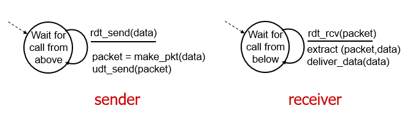

# 4계층: 전송계층Transport Layer

다른 호스트에서 실행되는 프로세스들의 논리적 소통을 제공함

- 송신측 : 메시지를 세그먼트로 쪼갬, tcp 헤더 붙임, 하위 계층(네트워크 레이어)로 내린다.
- 수신측 : 세그먼트를 조합하여 메시지를 만듦, 상위 계층으로 올린다.

**네트워크 계층 vs 전송 계층**

네트워크 계층 - 호스트 사이의 논리적 연결 (우리 동네까지만 오면 됨)

전송 계층 - 프로세스 사이의 논리적 연결 (직접 나한테까지 와야됨)

**전송 계층의 프로토콜**

- Reliable, in-order = **TCP(Transmission Control Protocol)**
  - Congestion control
  - Flow control
  - Connection setup
- Unreliable, unordered = **UDP(User Datagram Protocol)**

**Multiplexing & Demultiplexing 다중화&역다중화**

- 프로세스는 소켓을 통해 데이터를 주고받음(문), 4계층→소켓→응용 계층
- 소켓이 생성되면 transport layer는 자동으로 포트 번호를 소켓에 할당함.
- 전송 측 : 데이터에 헤더를 붙인다. 헤더의 정보를 통해 소켓을 식별함
  - UDP : dest port#, dest ip
  - TCP : source port#, dest port#, source ip, dest ip
- 수신 측 : 헤더의 정보를 바탕으로 세그먼트를 옳은 소켓으로 보낸다.

## **UDP**

- reliable하지 않음, 전송되는 데 out-of-order
- loss여도 괜찮고 속도가 중요한 곳에 사용됨
- DNS(Domain Name Server)에도 사용됨
- congestion control X, connection X
- 헤더의 사이즈가 작음

## TCP

- 7~4계층은 reliable, 3~1계층은 unreliable하다.
- 따라서 4계층에서는 신뢰적인 데이터 전송(rdt)를 한다.

### rdt 1.0 : 완전 믿을 수 있는 채널

⇒ 이는 채널이 **비트에러**도 없고, **패킷 loss**도 없기 때문에 가능하다.

하지만 세상에 이런 것은 존재할 수 없음…

### rdt 2.0 : 비트 에러가 발생하는 채널

- ACK와 NAK를 이용해 패킷에 에러가 있는지 없는지 송신 측에 답장을 하자!

- 에러 검출에는 ‘체크섬’을 이용함
  
  

- 그럼 ACK와 NAK가 손상되면?
  
  - sender는 receiver한테 무슨 일이 일어났는지 모름
  - ACK나 NAK가 없다고 무조건 다시 보내면 → 패킷 중복 발생

⇒ 패킷에 sequence #를 붙임!

### rdt 2.1 : 비트 에러가 발생하는 채널 - 중복 패킷 방지(seq #)

- 여기서는 0과 1로 순서를 붙임

- 패킷 0에 대한 ACK나 NAK 0 or 패킷 1에 대한 ACK나 NAK 1
  
  
  
  

- 그런데 ACK, NAK 구분하지 말고 그냥 ACK만 쓰면 어떨까?

- ACK를 보내는 패킷에 대한 순서를 명시하자!! `include seq # of pkt being ACKed`

⇒ 중복된 ACK는 NAK와 같은 결과! 다시 패킷을 재전송하면 된다구

### rdt 2.2 : 비트 에러가 발생하는 채널 - 중복 패킷 방지(NAK-free protocol)

- NAK대신, 마지막으로 받은 pkt에 대한 ACK만을 전송한다.

- ACK가 중복으로 오면, 패킷에 문제가 발생했다는 뜻이므로 현재 pkt을 재전송한다.
  
  
  
  

### rdt 3.0 : 비트 에러와 loss가 발생하는 채널

- 아래 계층 (L1~L3)에서 패킷이 실종(!)될 수도 있음
  
  - 지금 checksum, seq #, ACKs를 이용한 재전송도 좋지만… 더!

- 타이머를 이용해서 일정 시간동안 ACK를 기다리자
  
  - 만약 ACK가 lost된 것이 아니라 그냥 늦게 온 상황이면?
    - 어차피 중복 pkt은 seq #를 통해 관리할 수 있음
  
  

- 그런데 패킷 하나하나 보내면,,, 너무 느리지 않니?

⇒ **pipelining**

아직 ACK가 오지 않은 패킷들을 여러개 보내는 것

네트워크의 효용성을 높일 수 이따… 2가지 방식 존재!

1. **Go-Back-N (GBN)**
   
   - 송신 측은 최대 N개의 unACKed pkt을 동시에 보낼 수 있음
   - 수신 측은 연속된 ACK만 전송함 → 패킷 seq#에 차이가 있으면 ACK를 보내지 않음
   - 송신 측은 타이머가 끝나면 그 패킷부터 다시보냄.
   
   

2. **Selective Repeat**
   
   - 송신 측은 최대 N개의 unACKed pkt을 동시에 보낼 수 있음
   - 수신 측은 각각의 패킷에 대한 각각의 ACK를 전송함
   - 송신 측은 각각의 패킷의 ACK를 기다리고, timer가 끝나면 그 패킷만 다시 전송
   
   

### reliable transmission 을 위해 사용된 개념

- Checksum
- Timer
- Sequence #
- ACK, NAK
- window
- pipelining

우리가 지금까지는 pkt seq # 를 1, 2, 3…으로 배웠지만, 실제로는 패킷의 크기이다.

500,000bytes 짜리 파일을 1,000 bytes로 쪼개서 전송하면, 첫번째 seq#는 0, 두 번째 패킷의 seq#는 1,000, 세 번째 패킷의 seq#는 2,000….

- `MSS`(Maximum Segment Size) 세그먼트의 최대 크기 ⇒ 1460byte
- `MTU`(Maximum Transmission Unit) 세그먼트 + IP헤더(20byte) + TCP헤더(20byte)

### Seq

- 패킷을 보낼 때 seq # : 최초의 seq # 부터! Initial Seq # + 내가 보낸 byte의 크기 숫자

- ACK의 seq # : 내가 받고자 하는 숫자를 전송함.
  
  

### Timer

TCP의 타이머 시간을 어떻게 조절할까?

→ 당연히 RTT(패킷이 왔다갔다 하는 시간)보다 길어야함, 너무 짧으면 중복패킷이 많아지고 너무 길면 패킷loss가 발생해도 금방 알아차리지 못함

⇒ RTT시간을 누적하여 평균을 구한다. 가중치는 과거의 누적RTT값에 더 많이 준다.

### TCP fast retransmit(GBN과 Selective Repeat의 Hybrid 형)

타이머가 다 되지 않아도 문제가 발생했다는 것을 알아차릴 수 있음!

세그먼트에 문제가 생기면, 그 전의 멀쩡했던 패킷에 대해서 중복 ACK를 발생시킴

중복 ACK가 3개 오면, 다음 seq# 에 맞춰 재전송

## TCP의 특징!

- **handshake**
  
  연결 과정, 클라이언트와 호스트가 connection을 맺는 과정
  
  3번의 과정을 거치기 때문에 **3-way handshake**임
  
  
  
  

- **flow control**
  
  센더가 보내는 패킷들이 리시버의 buffer 크기를 넘치지 않도록 보내는 양을 조절하는 것.
  
  receive window를 통해 receiver buffer의 상황을 알 수 있음
  
  - 수신 측
    
    패킷을 받으면, 버퍼에서 여유 공간을 구해 TCP 헤더의 rwnd value에 값을 적는다.
  
  - 송신 측
    
    ACK의 rwnd value의 크기에 맞춰 보낼 패킷의 양을 조절한다 ⇒ 오버플로우가 발생하지 않도록!

